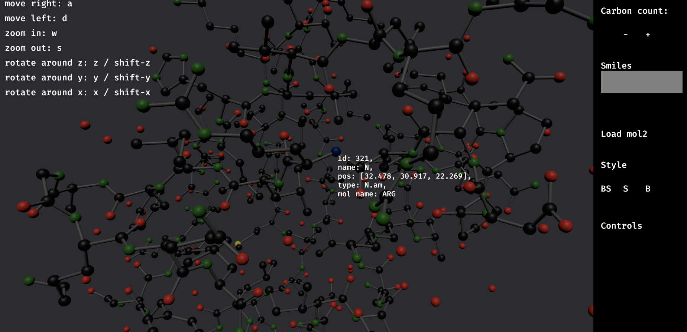
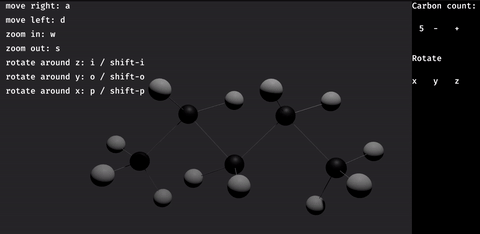
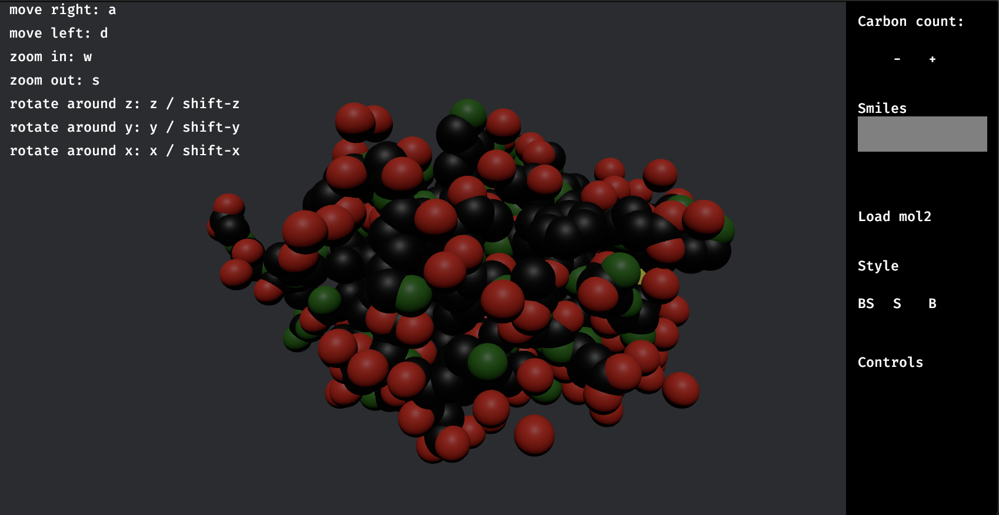

# mol

A minimal molecule explorer.

WIP!

It also includes an experimental linear alkane generator.




Try it out [live](https://cool-sunshine-4a2b07.netlify.app/)!

## Instructions

#### Library

```
mol = { git = "https://github.com/ivnsch/mol.git" }

```

```rust
mol::init_sim();
```

#### WASM

```
wasm-pack build --out-dir /<root_dir_of_next_app>/wasm --release
```

`--release` currently mandatory
https://github.com/bevyengine/bevy/issues/16030

Next.js app (for now separate):
https://github.com/ivnsch/mol_next_app_tmp

```
npm run dev
```



## Contribute

1. Fork
2. Commit changes to a branch in your fork
3. Push your code and make a pull request
